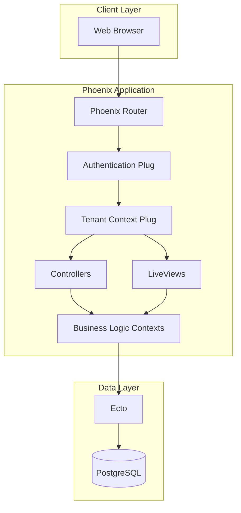
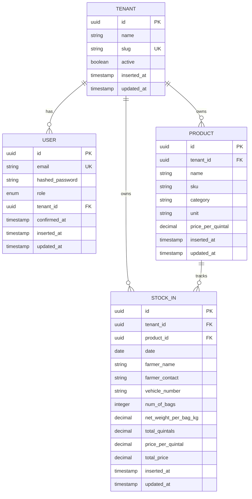

# Design Document: Rice Mill Inventory Management System

## Overview

The Rice Mill Inventory Management System is a multi-tenant web application built with Elixir and Phoenix Framework, using PostgreSQL for data persistence. The system enables rice mill operators to manage paddy products and record stock-in transactions from farmer purchases, with automatic calculations for weight and pricing.

## Architecture

### High-Level Architecture



### Multi-Tenancy Strategy

The system implements a **shared database with tenant isolation** approach:
- Single PostgreSQL database with `tenant_id` column in all tenant-scoped tables
- Tenant context is established during authentication and maintained in session
- All queries are automatically scoped to the current tenant using Ecto query prefixes or filters
- Super admin can switch tenant context to access different organizations

### Technology Stack

- **Language**: Elixir 1.14+
- **Web Framework**: Phoenix 1.7+
- **Database**: PostgreSQL 14+
- **ORM**: Ecto 3.10+
- **Authentication**: Phoenix built-in authentication generators
- **UI**: Phoenix LiveView with Tailwind CSS

## Components and Interfaces

### 1. Authentication System

**Module**: `RiceMillWeb.UserAuth`

**Responsibilities**:
- Handle user login/logout
- Manage session tokens
- Identify user role (super_admin or tenant_user)
- Set tenant context in connection

**Key Functions**:
- `log_in_user/3` - Authenticate and establish session
- `fetch_current_user/2` - Retrieve authenticated user from session
- `require_authenticated_user/2` - Plug to protect routes
- `set_tenant_context/2` - Establish tenant scope

### 2. Tenant Management

**Module**: `RiceMill.Accounts`

**Schema**: `Tenant`
- `id` (UUID, primary key)
- `name` (string, required)
- `slug` (string, unique, required)
- `active` (boolean, default: true)
- `inserted_at`, `updated_at` (timestamps)

**Schema**: `User`
- `id` (UUID, primary key)
- `email` (string, unique, required)
- `hashed_password` (string, required)
- `role` (enum: :super_admin, :tenant_user)
- `tenant_id` (UUID, foreign key, nullable for super_admin)
- `confirmed_at` (naive_datetime)
- `inserted_at`, `updated_at` (timestamps)

### 3. Product Management

**Module**: `RiceMill.Inventory`

**Schema**: `Product`
- `id` (UUID, primary key)
- `tenant_id` (UUID, foreign key, required)
- `name` (string, required)
- `sku` (string, required, unique per tenant)
- `category` (string, default: "Paddy", immutable)
- `unit` (string, default: "quintal")
- `price_per_quintal` (decimal, precision: 10, scale: 2, required)
- `inserted_at`, `updated_at` (timestamps)

**Key Functions**:
- `list_products/1` - List all products for tenant
- `get_product!/2` - Get product by ID with tenant scope
- `create_product/2` - Create new product
- `update_product/2` - Update product (category locked)
- `delete_product/1` - Delete product

**Validations**:
- Name: required, max 255 characters
- SKU: required, unique within tenant
- Category: always "Paddy"
- Price per quintal: required, positive decimal

### 4. Stock-In Management

**Module**: `RiceMill.Inventory`

**Schema**: `StockIn`
- `id` (UUID, primary key)
- `tenant_id` (UUID, foreign key, required)
- `product_id` (UUID, foreign key, required)
- `date` (date, required)
- `farmer_name` (string, required)
- `farmer_contact` (string, required)
- `vehicle_number` (string, required)
- `num_of_bags` (integer, required)
- `net_weight_per_bag_kg` (decimal, precision: 8, scale: 2, required)
- `total_quintals` (decimal, precision: 10, scale: 3, computed)
- `price_per_quintal` (decimal, precision: 10, scale: 2, required)
- `total_price` (decimal, precision: 12, scale: 2, computed)
- `inserted_at`, `updated_at` (timestamps)

**Key Functions**:
- `list_stock_ins/2` - List stock-in entries with optional filters
- `get_stock_in!/2` - Get stock-in by ID with tenant scope
- `create_stock_in/2` - Create new stock-in entry with calculations
- `calculate_totals/1` - Calculate total_quintals and total_price

**Calculations**:
```elixir
total_quintals = (num_of_bags * net_weight_per_bag_kg) / 100
total_price = total_quintals * price_per_quintal
```

**Validations**:
- Product ID: required, must exist in tenant
- Date: required, cannot be future date
- Farmer name: required, max 255 characters
- Farmer contact: required, max 20 characters
- Vehicle number: required, max 50 characters
- Number of bags: required, positive integer
- Net weight per bag: required, positive decimal

### 5. Reporting

**Module**: `RiceMill.Reports`

**Key Functions**:
- `current_stock_levels/1` - Aggregate stock by product
- `stock_in_history/2` - List transactions with filters

**Stock Level Query**:
```sql
SELECT 
  p.id, p.name, p.sku,
  COALESCE(SUM(si.total_quintals), 0) as total_stock
FROM products p
LEFT JOIN stock_ins si ON si.product_id = p.id
WHERE p.tenant_id = ?
GROUP BY p.id, p.name, p.sku
ORDER BY p.name
```

### 6. Web Interface

**LiveViews**:

1. **ProductLive.Index** - List products with add/edit/delete actions
2. **ProductLive.FormComponent** - Product form modal
3. **StockInLive.Index** - List stock-in entries with filters
4. **StockInLive.FormComponent** - Stock-in form with auto-calculations
5. **ReportLive.StockLevels** - Current stock report
6. **ReportLive.History** - Transaction history with filters

**Routes**:
```elixir
scope "/", RiceMillWeb do
  pipe_through [:browser, :require_authenticated_user]
  
  live "/products", ProductLive.Index, :index
  live "/products/new", ProductLive.Index, :new
  live "/products/:id/edit", ProductLive.Index, :edit
  
  live "/stock-ins", StockInLive.Index, :index
  live "/stock-ins/new", StockInLive.Index, :new
  
  live "/reports/stock-levels", ReportLive.StockLevels, :index
  live "/reports/history", ReportLive.History, :index
end

scope "/", RiceMillWeb do
  pipe_through [:browser, :redirect_if_user_is_authenticated]
  
  live "/login", UserLoginLive, :new
end
```

## Data Models

### Entity Relationship Diagram



### Database Indexes

**Products Table**:
- Primary key on `id`
- Index on `tenant_id`
- Unique index on `(tenant_id, sku)`

**Stock-Ins Table**:
- Primary key on `id`
- Index on `tenant_id`
- Index on `product_id`
- Index on `date` (for filtering)
- Index on `farmer_name` (for filtering)

**Users Table**:
- Primary key on `id`
- Unique index on `email`
- Index on `tenant_id`

**Tenants Table**:
- Primary key on `id`
- Unique index on `slug`

## Error Handling

### Validation Errors

- Display inline validation errors in forms using Phoenix LiveView changesets
- Show error messages in red text below input fields
- Prevent form submission until all validations pass

### Database Errors

- Handle unique constraint violations (duplicate SKU) with user-friendly messages
- Handle foreign key violations (deleted product) with appropriate error messages
- Wrap database operations in transactions where multiple operations occur

### Authorization Errors

- Redirect unauthorized users to login page
- Show 404 for resources not belonging to current tenant
- Log authorization failures for security monitoring

### Application Errors

- Use Phoenix error views for 404 and 500 errors
- Log all errors to application logs
- Display generic error message to users while logging details

## Testing Strategy

### Unit Tests

- Test context functions (Inventory, Accounts, Reports)
- Test calculation logic for total_quintals and total_price
- Test validation rules for all schemas
- Test tenant scoping in queries

### Integration Tests

- Test LiveView interactions (form submissions, filtering)
- Test authentication flow (login, logout, session management)
- Test multi-tenancy isolation (ensure data separation)
- Test auto-fill functionality for product pricing

### Database Tests

- Use Ecto sandbox for test isolation
- Test database constraints (unique, foreign key, not null)
- Test indexes are created correctly
- Test migrations are reversible

## UI/UX Design Principles

### Layout

- Simple navigation bar with links to Products, Stock-In, and Reports
- Responsive design using Tailwind CSS
- Clean white background with subtle borders
- Consistent spacing and typography

### Forms

- Clear labels above input fields
- Placeholder text for guidance
- Inline validation feedback
- Primary action buttons in blue
- Cancel/secondary buttons in gray

### Tables

- Striped rows for readability
- Sortable columns where applicable
- Action buttons (edit, delete) aligned right
- Pagination for large datasets

### Color Scheme

- Primary: Blue (#3B82F6)
- Success: Green (#10B981)
- Error: Red (#EF4444)
- Neutral: Gray (#6B7280)
- Background: White (#FFFFFF)

## Security Considerations

1. **Password Security**: Use bcrypt for password hashing
2. **Session Management**: Secure session tokens with proper expiration
3. **SQL Injection**: Use Ecto parameterized queries
4. **CSRF Protection**: Enable Phoenix CSRF protection
5. **Tenant Isolation**: Always scope queries by tenant_id
6. **Input Validation**: Validate and sanitize all user inputs
7. **Role-Based Access**: Enforce role checks for super admin features

## Performance Considerations

1. **Database Indexes**: Index foreign keys and frequently queried columns
2. **Query Optimization**: Use Ecto preloading to avoid N+1 queries
3. **Caching**: Consider caching product list for auto-fill
4. **Pagination**: Implement pagination for large result sets
5. **Connection Pooling**: Configure appropriate database pool size

## Deployment Considerations

1. **Environment Variables**: Store database credentials and secrets
2. **Database Migrations**: Run migrations before deployment
3. **Asset Compilation**: Compile assets in production mode
4. **Health Checks**: Implement health check endpoint
5. **Logging**: Configure appropriate log levels for production
