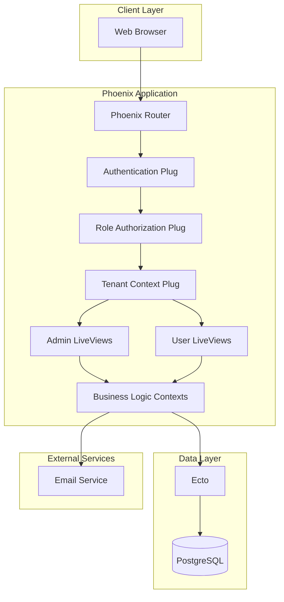
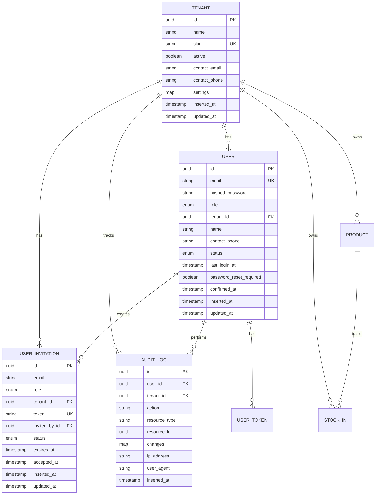

# Design Document: Tenant and User Management System

## Overview

The Tenant and User Management System extends the existing Rice Mill Inventory application with comprehensive administrative capabilities. It enables super administrators to onboard new tenants and manage the entire system, while company administrators can manage users within their own tenant. The system implements role-based access control with four distinct roles (super_admin, company_admin, operator, viewer), user invitation workflows, audit logging, and activity monitoring.

This design builds upon the existing multi-tenant architecture with shared database and tenant isolation strategy, extending the current `Accounts` context and authentication system.

## Architecture

### High-Level Architecture



### Role-Based Access Control Strategy

The system implements a hierarchical role-based access control (RBAC) model:

**Role Hierarchy:**
```
super_admin (system-wide access)
  └── company_admin (tenant-scoped admin)
        ├── operator (can create/edit inventory)
        └── viewer (read-only access)
```

**Permission Matrix:**

| Feature | super_admin | company_admin | operator | viewer |
|---------|-------------|---------------|----------|--------|
| Manage all tenants | ✓ | ✗ | ✗ | ✗ |
| Manage all users | ✓ | ✗ | ✗ | ✗ |
| Manage tenant users | ✓ | ✓ | ✗ | ✗ |
| View audit logs (all) | ✓ | ✗ | ✗ | ✗ |
| View audit logs (tenant) | ✓ | ✓ | ✗ | ✗ |
| Manage products | ✓ | ✓ | ✓ | ✗ |
| Manage stock-in | ✓ | ✓ | ✓ | ✗ |
| View reports | ✓ | ✓ | ✓ | ✓ |
| Manage tenant settings | ✓ | ✓ | ✗ | ✗ |

### Technology Stack

- **Language**: Elixir 1.14+
- **Web Framework**: Phoenix 1.7+
- **Database**: PostgreSQL 14+
- **ORM**: Ecto 3.10+
- **Authentication**: Phoenix built-in authentication (existing)
- **UI**: Phoenix LiveView with Tailwind CSS
- **Email**: Swoosh (for user invitations)
- **CSV Parsing**: NimbleCSV (for bulk import)

## Components and Interfaces

### 1. Extended User Schema

**Module**: `RiceMill.Accounts.User`

**Updated Schema Fields:**
- `id` (UUID, primary key) - existing
- `email` (string, unique, required) - existing
- `hashed_password` (string, required) - existing
- `role` (enum: :super_admin, :company_admin, :operator, :viewer) - **extended**
- `tenant_id` (UUID, foreign key, nullable for super_admin) - existing
- `confirmed_at` (naive_datetime) - existing
- `name` (string) - **new**
- `contact_phone` (string) - **new**
- `status` (enum: :active, :inactive, default: :active) - **new**
- `last_login_at` (utc_datetime) - **new**
- `password_reset_required` (boolean, default: false) - **new**
- `inserted_at`, `updated_at` (timestamps) - existing

**New Validations:**
- Role: required, one of [:super_admin, :company_admin, :operator, :viewer]
- Status: required, one of [:active, :inactive]
- Name: optional, max 255 characters
- Contact phone: optional, max 20 characters
- Tenant ID: required for non-super_admin roles, must be nil for super_admin

### 2. Extended Tenant Schema

**Module**: `RiceMill.Accounts.Tenant`

**Updated Schema Fields:**
- `id` (UUID, primary key) - existing
- `name` (string, required) - existing
- `slug` (string, unique, required) - existing
- `active` (boolean, default: true) - existing
- `contact_email` (string) - **new**
- `contact_phone` (string) - **new**
- `settings` (map, default: %{}) - **new**
- `inserted_at`, `updated_at` (timestamps) - existing

**Settings Map Structure:**
```elixir
%{
  default_unit: "quintal",
  default_category: "Paddy",
  timezone: "Asia/Kolkata",
  date_format: "dd/mm/yyyy"
}
```

### 3. User Invitation Schema

**Module**: `RiceMill.Accounts.UserInvitation`

**Schema**: `UserInvitation`
- `id` (UUID, primary key)
- `email` (string, required)
- `role` (enum: :operator, :viewer, required) - Note: company_admin role can only be created by super_admin directly
- `tenant_id` (UUID, foreign key, required)
- `token` (string, unique, required)
- `invited_by_id` (UUID, foreign key to users, required)
- `status` (enum: :pending, :accepted, :expired, default: :pending)
- `expires_at` (utc_datetime, required)
- `accepted_at` (utc_datetime)
- `inserted_at`, `updated_at` (timestamps)

**Key Functions:**
- `create_invitation/3` - Create invitation with token generation
- `get_invitation_by_token/1` - Retrieve invitation by token
- `accept_invitation/2` - Mark invitation as accepted
- `expire_old_invitations/0` - Background job to expire old invitations

**Token Generation:**
```elixir
token = :crypto.strong_rand_bytes(32) |> Base.url_encode64(padding: false)
expires_at = DateTime.utc_now() |> DateTime.add(7, :day)
```

### 4. Audit Log Schema

**Module**: `RiceMill.Accounts.AuditLog`

**Schema**: `AuditLog`
- `id` (UUID, primary key)
- `user_id` (UUID, foreign key, required)
- `tenant_id` (UUID, foreign key, nullable)
- `action` (string, required) - e.g., "user.created", "user.deleted", "login.success"
- `resource_type` (string) - e.g., "User", "Tenant", "Product"
- `resource_id` (UUID)
- `changes` (map) - JSON field storing before/after values
- `ip_address` (string)
- `user_agent` (string)
- `inserted_at` (timestamp)

**Auditable Actions:**
- `user.created`, `user.updated`, `user.deleted`, `user.activated`, `user.deactivated`
- `tenant.created`, `tenant.updated`, `tenant.deleted`
- `login.success`, `login.failed`, `logout`
- `password.reset`, `password.changed`
- `invitation.sent`, `invitation.accepted`

**Key Functions:**
- `log_action/4` - Create audit log entry
- `list_audit_logs/2` - List logs with filters (tenant, user, action, date range)
- `get_user_activity/2` - Get activity for specific user

### 5. Extended Accounts Context

**Module**: `RiceMill.Accounts`

**New Functions for User Management:**

```elixir
# User CRUD with role-based scoping
list_users(scope, filters \\ %{})
list_users_for_tenant(tenant_id, filters \\ %{})
get_user!(id, scope)
create_user(attrs, created_by_scope)
update_user(user, attrs, updated_by_scope)
delete_user(user, deleted_by_scope)
deactivate_user(user, scope)
activate_user(user, scope)

# User invitation
create_invitation(attrs, invited_by_scope)
send_invitation_email(invitation)
accept_invitation(token, user_attrs)
list_pending_invitations(tenant_id)
cancel_invitation(invitation, scope)

# Password management
reset_user_password(user, scope)
generate_temporary_password()
require_password_change(user)

# Bulk operations
import_users_from_csv(csv_data, tenant_id, scope)
validate_csv_import(csv_data)

# Activity tracking
update_last_login(user)
get_user_activity_summary(user_id, scope)
```

**New Functions for Tenant Management:**

```elixir
# Tenant CRUD (super admin only)
list_tenants_with_stats()
get_tenant_with_stats!(id)
create_tenant_with_admin(tenant_attrs, admin_attrs, scope)
update_tenant(tenant, attrs, scope)
deactivate_tenant(tenant, scope)
activate_tenant(tenant, scope)

# Tenant settings
get_tenant_settings(tenant_id)
update_tenant_settings(tenant_id, settings, scope)

# Tenant activity
get_tenant_activity_metrics(tenant_id)
list_active_tenants(days \\ 30)
list_inactive_tenants(days \\ 30)
```

### 6. Authorization Module

**Module**: `RiceMill.Accounts.Authorization`

**Purpose**: Centralized authorization logic for role-based access control

**Key Functions:**

```elixir
# Role checks
can?(scope, action, resource)
has_role?(scope, roles)
super_admin?(scope)
company_admin?(scope)
same_tenant?(scope, resource)

# Permission checks
can_manage_users?(scope, tenant_id)
can_manage_tenants?(scope)
can_view_audit_logs?(scope, tenant_id)
can_manage_inventory?(scope)
can_view_reports?(scope)

# Resource authorization
authorize!(scope, action, resource)
```

**Authorization Rules:**

```elixir
def can?(%Scope{user: %User{role: :super_admin}}, _action, _resource), do: true

def can?(%Scope{user: %User{role: :company_admin, tenant_id: tid}}, :manage_users, %{tenant_id: tid}), do: true

def can?(%Scope{user: %User{role: role}}, :manage_inventory, _) 
  when role in [:company_admin, :operator], do: true

def can?(%Scope{user: %User{role: role}}, :view_reports, _) 
  when role in [:company_admin, :operator, :viewer], do: true

def can?(_, _, _), do: false
```

### 7. Web Interface - LiveViews

#### Admin LiveViews (Super Admin)

**1. TenantLive.Index** - `/admin/tenants`
- List all tenants with stats (user count, last activity)
- Search and filter tenants
- Create new tenant with admin user
- View tenant details
- Activate/deactivate tenants

**2. TenantLive.Show** - `/admin/tenants/:id`
- Tenant details and settings
- List of users in tenant
- Activity metrics
- Edit tenant information

**3. AdminUserLive.Index** - `/admin/users`
- List all users across all tenants
- Search by email, tenant, role
- Create users for any tenant
- Edit user details
- Reset passwords
- View user activity

**4. AuditLogLive.Index** - `/admin/audit-logs`
- List all audit logs
- Filter by tenant, user, action, date range
- Export audit logs
- View detailed log entries

#### Company Admin LiveViews

**5. UserManagementLive.Index** - `/users/manage`
- List users in current tenant
- Search and filter users
- Invite new users
- Edit user details (within tenant)
- Activate/deactivate users
- Reset passwords

**6. UserManagementLive.InvitationForm** - `/users/manage/invite`
- Send user invitation
- Select role (operator, viewer)
- Preview invitation email

**7. UserManagementLive.BulkImport** - `/users/manage/import`
- Upload CSV file
- Preview import data
- Validate and import users
- View import results

**8. TenantSettingsLive.Index** - `/settings/tenant`
- Edit tenant information
- Configure tenant settings
- View tenant activity

#### User LiveViews

**9. UserProfileLive.Index** - `/users/profile`
- View and edit own profile
- Change password
- View own activity history

**10. UserInvitationLive.Accept** - `/invitations/:token`
- Accept invitation
- Set password
- Complete registration

### 8. Plugs and Middleware

**Module**: `RiceMillWeb.Plugs.RequireRole`

**Purpose**: Enforce role-based access to routes

```elixir
defmodule RiceMillWeb.Plugs.RequireRole do
  import Plug.Conn
  import Phoenix.Controller
  alias RiceMill.Accounts.Authorization

  def init(opts), do: opts

  def call(conn, roles) when is_list(roles) do
    scope = conn.assigns.current_scope

    if Authorization.has_role?(scope, roles) do
      conn
    else
      conn
      |> put_flash(:error, "You don't have permission to access this page.")
      |> redirect(to: "/")
      |> halt()
    end
  end
end
```

**Module**: `RiceMillWeb.Plugs.LoadTenantContext`

**Purpose**: Load tenant context for company admins

```elixir
defmodule RiceMillWeb.Plugs.LoadTenantContext do
  import Plug.Conn
  alias RiceMill.Accounts

  def init(opts), do: opts

  def call(conn, _opts) do
    scope = conn.assigns.current_scope

    if scope && scope.user && scope.user.tenant_id do
      tenant = Accounts.get_tenant!(scope.user.tenant_id)
      assign(conn, :current_tenant, tenant)
    else
      conn
    end
  end
end
```

### 9. Email Notifications

**Module**: `RiceMill.Accounts.UserNotifier`

**Extended Email Templates:**

1. **User Invitation Email**
```elixir
def deliver_user_invitation(invitation, invited_by_name) do
  url = url(~p"/invitations/#{invitation.token}/accept")
  
  new()
  |> to(invitation.email)
  |> from({"Rice Mill System", "noreply@ricemill.example.com"})
  |> subject("You've been invited to Rice Mill System")
  |> html_body("""
    <p>Hello,</p>
    <p>#{invited_by_name} has invited you to join their organization on Rice Mill System.</p>
    <p>Click the link below to accept the invitation and set your password:</p>
    <p><a href="#{url}">Accept Invitation</a></p>
    <p>This invitation will expire in 7 days.</p>
  """)
end
```

2. **Password Reset Email**
```elixir
def deliver_password_reset(user, temporary_password) do
  new()
  |> to(user.email)
  |> from({"Rice Mill System", "noreply@ricemill.example.com"})
  |> subject("Your password has been reset")
  |> html_body("""
    <p>Hello #{user.name},</p>
    <p>Your password has been reset by an administrator.</p>
    <p>Temporary Password: <strong>#{temporary_password}</strong></p>
    <p>You will be required to change this password upon your next login.</p>
  """)
end
```

3. **Welcome Email**
```elixir
def deliver_welcome_email(user, tenant_name) do
  new()
  |> to(user.email)
  |> from({"Rice Mill System", "noreply@ricemill.example.com"})
  |> subject("Welcome to Rice Mill System")
  |> html_body("""
    <p>Hello #{user.name},</p>
    <p>Welcome to #{tenant_name} on Rice Mill System!</p>
    <p>You can now log in and start managing your inventory.</p>
  """)
end
```

## Data Models

### Entity Relationship Diagram



### Database Indexes

**Users Table:**
- Primary key on `id`
- Unique index on `email`
- Index on `tenant_id`
- Index on `role`
- Index on `status`
- Index on `last_login_at` (for activity queries)

**Tenants Table:**
- Primary key on `id`
- Unique index on `slug`
- Index on `active`

**User Invitations Table:**
- Primary key on `id`
- Unique index on `token`
- Index on `tenant_id`
- Index on `email`
- Index on `status`
- Index on `expires_at` (for cleanup jobs)

**Audit Logs Table:**
- Primary key on `id`
- Index on `user_id`
- Index on `tenant_id`
- Index on `action`
- Index on `inserted_at` (for date range queries)
- Composite index on `(tenant_id, inserted_at)` (for tenant activity)

### Database Migrations

**Migration 1: Extend Users Table**
```elixir
alter table(:users) do
  modify :role, :string, default: "operator"
  add :name, :string
  add :contact_phone, :string
  add :status, :string, default: "active", null: false
  add :last_login_at, :utc_datetime
  add :password_reset_required, :boolean, default: false
end

create index(:users, [:role])
create index(:users, [:status])
create index(:users, [:last_login_at])
```

**Migration 2: Extend Tenants Table**
```elixir
alter table(:tenants) do
  add :contact_email, :string
  add :contact_phone, :string
  add :settings, :map, default: %{}
end
```

**Migration 3: Create User Invitations Table**
```elixir
create table(:user_invitations, primary_key: false) do
  add :id, :binary_id, primary_key: true
  add :email, :string, null: false
  add :role, :string, null: false
  add :tenant_id, references(:tenants, type: :binary_id, on_delete: :delete_all), null: false
  add :token, :string, null: false
  add :invited_by_id, references(:users, type: :binary_id, on_delete: :nilify_all), null: false
  add :status, :string, default: "pending", null: false
  add :expires_at, :utc_datetime, null: false
  add :accepted_at, :utc_datetime

  timestamps(type: :utc_datetime)
end

create unique_index(:user_invitations, [:token])
create index(:user_invitations, [:tenant_id])
create index(:user_invitations, [:email])
create index(:user_invitations, [:status])
create index(:user_invitations, [:expires_at])
```

**Migration 4: Create Audit Logs Table**
```elixir
create table(:audit_logs, primary_key: false) do
  add :id, :binary_id, primary_key: true
  add :user_id, references(:users, type: :binary_id, on_delete: :nilify_all)
  add :tenant_id, references(:tenants, type: :binary_id, on_delete: :nilify_all)
  add :action, :string, null: false
  add :resource_type, :string
  add :resource_id, :binary_id
  add :changes, :map
  add :ip_address, :string
  add :user_agent, :text

  timestamps(type: :utc_datetime, updated_at: false)
end

create index(:audit_logs, [:user_id])
create index(:audit_logs, [:tenant_id])
create index(:audit_logs, [:action])
create index(:audit_logs, [:inserted_at])
create index(:audit_logs, [:tenant_id, :inserted_at])
```

## Error Handling

### Validation Errors

- Display inline validation errors in forms using Phoenix LiveView changesets
- Show error messages for invalid role assignments
- Validate email uniqueness across all tenants
- Validate invitation token expiration
- Validate CSV import data with detailed error messages

### Authorization Errors

- Return 403 Forbidden for unauthorized actions
- Redirect to appropriate page with error message
- Log authorization failures in audit log
- Display user-friendly error messages

### Database Errors

- Handle unique constraint violations (duplicate email)
- Handle foreign key violations (deleted tenant/user)
- Wrap multi-step operations in transactions
- Rollback on any failure in transaction

### Application Errors

- Use Phoenix error views for 404 and 500 errors
- Log all errors with context (user, tenant, action)
- Display generic error message to users
- Send error notifications for critical failures

## Security Considerations

### Authentication & Authorization

1. **Password Security**: Use bcrypt for password hashing (existing)
2. **Session Management**: Secure session tokens with proper expiration
3. **Role Enforcement**: Always check roles before allowing actions
4. **Tenant Isolation**: Enforce tenant scoping in all queries
5. **Invitation Tokens**: Use cryptographically secure random tokens
6. **Token Expiration**: Expire invitation tokens after 7 days

### Audit Logging

1. **Comprehensive Logging**: Log all administrative actions
2. **Immutable Logs**: Audit logs cannot be modified or deleted
3. **IP Tracking**: Store IP address for security investigations
4. **Change Tracking**: Store before/after values for updates

### Data Protection

1. **Input Validation**: Validate and sanitize all user inputs
2. **SQL Injection**: Use Ecto parameterized queries (existing)
3. **CSRF Protection**: Enable Phoenix CSRF protection (existing)
4. **XSS Prevention**: Escape all user-generated content
5. **Email Validation**: Validate email format and uniqueness

### Access Control

1. **Principle of Least Privilege**: Users have minimum required permissions
2. **Tenant Boundaries**: Strict enforcement of tenant data isolation
3. **Super Admin Restrictions**: Limit super admin accounts
4. **Password Policies**: Enforce strong password requirements
5. **Session Timeout**: Expire inactive sessions after 24 hours

## Performance Considerations

### Database Optimization

1. **Indexes**: Index all foreign keys and frequently queried columns
2. **Query Optimization**: Use Ecto preloading to avoid N+1 queries
3. **Pagination**: Implement pagination for all list views
4. **Audit Log Archival**: Archive old audit logs to separate table
5. **Connection Pooling**: Configure appropriate database pool size

### Caching Strategy

1. **Tenant Settings**: Cache tenant settings in memory
2. **User Permissions**: Cache user role and permissions
3. **Active Users Count**: Cache tenant user counts with TTL
4. **Audit Log Summaries**: Cache recent activity summaries

### Background Jobs

1. **Invitation Expiration**: Scheduled job to expire old invitations
2. **Audit Log Cleanup**: Archive logs older than 1 year
3. **Activity Metrics**: Calculate tenant activity metrics daily
4. **Email Queue**: Process invitation emails asynchronously

## Testing Strategy

### Unit Tests

- Test authorization logic for all roles
- Test user creation with different roles
- Test invitation token generation and validation
- Test audit log creation for all actions
- Test tenant settings management
- Test CSV import validation
- Test password reset functionality

### Integration Tests

- Test complete user invitation workflow
- Test tenant onboarding with admin creation
- Test role-based access to LiveViews
- Test bulk user import process
- Test audit log filtering and search
- Test tenant activity metrics calculation

### Authorization Tests

- Test super admin can access all features
- Test company admin can only manage own tenant
- Test operators cannot access user management
- Test viewers have read-only access
- Test cross-tenant access prevention

### LiveView Tests

- Test tenant management dashboard
- Test user management dashboard
- Test invitation form submission
- Test bulk import UI workflow
- Test audit log filtering
- Test profile editing

## UI/UX Design Principles

### Navigation

- Add "Admin" menu for super admins (Tenants, All Users, Audit Logs)
- Add "Users" menu for company admins (Manage Users, Invitations)
- Add "Settings" menu for tenant settings and profile
- Maintain existing navigation for inventory features

### Role-Based UI

- Show/hide menu items based on user role
- Display role badges next to user names
- Show tenant name in header for company admins
- Display "Super Admin" indicator for super admins

### Forms

- Use consistent form styling with existing inventory forms
- Show role selector with descriptions
- Display invitation preview before sending
- Show CSV import preview with validation errors
- Use modal dialogs for create/edit operations

### Tables

- Sortable columns for all list views
- Filterable columns (role, status, tenant)
- Action buttons (edit, delete, activate/deactivate)
- Pagination with page size selector
- Export functionality for audit logs

### Feedback

- Success messages for completed actions
- Error messages for validation failures
- Confirmation dialogs for destructive actions
- Loading indicators for async operations
- Toast notifications for background jobs

## Deployment Considerations

### Environment Variables

- `SUPER_ADMIN_EMAIL`: Initial super admin email
- `SUPER_ADMIN_PASSWORD`: Initial super admin password
- `INVITATION_EXPIRY_DAYS`: Days until invitation expires (default: 7)
- `SESSION_TIMEOUT_HOURS`: Hours until session expires (default: 24)
- `AUDIT_LOG_RETENTION_DAYS`: Days to retain audit logs (default: 365)

### Database Migrations

1. Run migrations to extend users and tenants tables
2. Create user_invitations and audit_logs tables
3. Update existing user roles if needed
4. Create initial super admin account

### Initial Setup

```elixir
# Create initial super admin
RiceMill.Accounts.register_user(%{
  email: System.get_env("SUPER_ADMIN_EMAIL"),
  password: System.get_env("SUPER_ADMIN_PASSWORD"),
  role: :super_admin,
  name: "System Administrator",
  status: :active
})
```

### Monitoring

1. **Health Checks**: Monitor user login success rate
2. **Audit Logs**: Alert on suspicious activity patterns
3. **Invitation Metrics**: Track invitation acceptance rate
4. **User Activity**: Monitor active users per tenant
5. **Error Tracking**: Alert on authorization failures

## Future Enhancements

### Phase 2 Features

1. **Two-Factor Authentication**: Add 2FA for enhanced security
2. **API Keys**: Generate API keys for programmatic access
3. **Advanced Permissions**: Granular permissions beyond roles
4. **User Groups**: Organize users into groups with shared permissions
5. **Tenant Branding**: Custom logos and colors per tenant
6. **Advanced Audit Search**: Full-text search in audit logs
7. **User Activity Dashboard**: Visual analytics for user activity
8. **Automated User Provisioning**: SCIM protocol support
9. **SSO Integration**: SAML/OAuth integration
10. **Mobile App Support**: API endpoints for mobile clients

